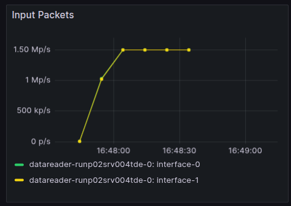

# Rebooting the TDE AMCs 
## 1. Setup the DUNEDAQ work area (if one does not exist, best to do so with np04daq)

link to original document: https://docs.google.com/document/d/11YRY5r1ubohd6CKcUmvigINU0Ai0OAEYItoTMzzrv7o/edit?tab=t.0

```
source /cvmfs/dunedaq.opensciencegrid.org/setup_dunedaq.sh
setup_dbt latest
cd /nfs/sw/dunedaq/tde-reboot/
dbt-create NFD_DEV_251016_A9
cd NFD_DEV_251016_A9/sourcecode

git clone https://github.com/DUNE-DAQ/tdemodules.git -b thea/card_reboot
cd ..

source env.sh
dbt-workarea-env
dbt-build

mkdir run; cd run
git clone

git clone https://gitlab.cern.ch/dune-daq/online/ehn1-daqconfigs.git
cd ehn1-daqconfigs
source setup_db_path.sh
cd ..
```

## 2. Start a session with the TDE enabled only
```
drunc-unified-shell ssh-CERN-kafka \ ehn1-daqconfigs/sessions/np02-tde-session.data.xml np02-tde-session \ $USER-tde-reboot
```

## 3. Bring the system to the configured state so ARPmessages can be sent/received
```
# in the drunc unified shell
boot
conf
```

## 4. Open a terminal on the control host np04-srv-013, and confirm with the amc butler the AMCs can be pinned (note that for X=39 and 40, there are only 8 AMCs, so if two do not respond this is expected.)
```
# in a fresh terminal on np04-srv-013
cd /nfs/sw/dunedaq/tde-reboot/
source env.sh
amc_butler.py 10.73.X.128 -c arping # X ranges from 32-41
```

## 5. On the control host (np04-srv-013), run the reboot script
```
tde-amc-reboot -a 10.73.X.128 # X ranges from 32-41
```

## 6. Once complete, Re-run the amc-bulter to make sure the AMCs can be pinged (note that for X=39 and 40, there are only 8 AMCs, so if two do not respond this is expected.)
```
amc_butler.py 10.73.X.128 -c arping # X ranges from 32-41
```

## 7. Manually start the AMCs to verify that the packet rates match the expected values (1.5 Mp/s, see screenshot at the end)
```
amc_butler.py 10.73.X.128 -c start # X ranges from 32-41
```

# 8. Shutdown the current session
```
# in the drunc unified shell
shutdown
```

## 9. Start a new run, confirm that the packet rate / 100G if and input packet rates per FH are the expected ones (1.5 Mp/s, see screenshot at the end)
```
# in the drunc unified shell
boot
conf
start-run ––run-type test
```

### ***Screenshot is taken from the fronted ethernet grafana dashboard***
